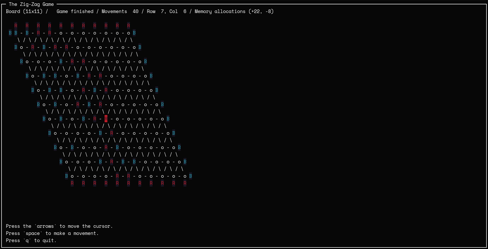

# Hex

This program is an implementation I wrote of the Hex game for Ira Pohl's last course of his [Coding for Everyone: C and C++ Specialization](https://www.coursera.org/specializations/coding-for-everyone) in Coursera.

> [!WARNING]
> This project is basically a home assignment that I took seriously as it's my first ever C++ program. Although the assignment didn't ask for tests and it was in principle meant to be submitted in a single file, I decided to structure it as a real life project.



## Install

To get started with the program, first clone it and open the cloned folder.

```bash
git clone https://github.com/elcapo/hex
cd hex
```

## Build

To create the binary files for your platform, run the `compile` script.

```bash
./compile
```

## Execute

The compilation will generate the binary files inside the `build` folder, with preserving the file structure.

To execute the program, run the `execute` script.

```bash
./execute
```

## Test

Unit tests are provided for each part of the program.

To run the all tests, run the `test` script.

```bash
./test
```